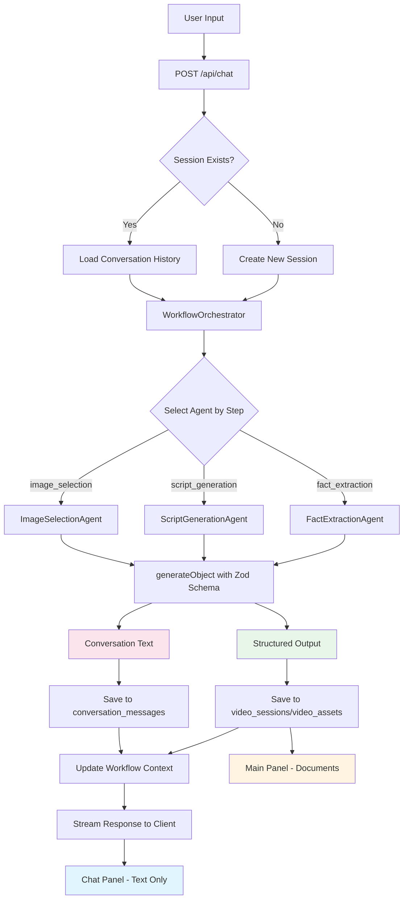

# Chat-Agent Architecture Documentation

## Overview

This document explains the separation between **chat conversation** (text messages) and **structured documents** (facts, scripts, images) in the educational video creation workflow. The architecture uses an **agent-based orchestrator pattern** with **structured outputs** to manage a multi-step workflow while maintaining clean separation of concerns.

## Architecture Principles

### 1. **Separation of Concerns**

- **Chat Panel (Left)**: Displays only text conversation between user and AI assistant
- **Main Content Area (Right)**: Displays structured documents (facts, scripts, images) for each workflow step
- **Database**: Stores both conversation history and structured documents separately

### 2. **Agent-Based Workflow**

Each workflow step is handled by a dedicated **Agent** that:

- Uses structured outputs (Zod schemas) for type-safe data extraction
- Processes user input and generates both conversational and structured responses
- Manages step transitions and background actions

### 3. **Orchestrator Pattern**

The **WorkflowOrchestrator** coordinates:

- Agent selection based on current workflow step
- Conversation history management
- Structured data persistence
- Workflow context updates

## Data Flow



## Database Schema

### Conversation Messages Table

Stores **text-only** conversation history:

```sql
CREATE TABLE video_conversation_message (
  id TEXT PRIMARY KEY,
  session_id TEXT NOT NULL REFERENCES video_session(id) ON DELETE CASCADE,
  role VARCHAR(20) NOT NULL, -- 'user' | 'assistant' | 'system'
  content TEXT NOT NULL, -- Text content only
  parts JSONB, -- UIMessage parts structure (for file attachments)
  metadata JSONB, -- References to structured data, workflow step
  created_at TIMESTAMP DEFAULT NOW()
);
```

**Key Points:**

- Stores only text conversation
- `metadata` contains references to structured data (not the data itself)
- Used for session resumption and chat history display

### Session & Assets Tables

Store **structured documents** for each step:

```sql
-- video_session table
ALTER TABLE video_session ADD COLUMN current_step VARCHAR(50);
ALTER TABLE video_session ADD COLUMN workflow_context JSONB;

-- Structured data stored in:
-- - confirmed_facts JSONB (facts from fact_extraction step)
-- - generated_script JSONB (script from script_generation step)
-- - video_asset table (images from image_selection step)
```

**Key Points:**

- Structured outputs stored in appropriate columns/tables
- `workflow_context` tracks current state and step
- Documents are editable in the main content area

## Workflow Steps

### Step 1: Fact Extraction

**Agent**: `FactExtractionAgent`

**Input**: User provides learning materials (text, PDF, URL)

**Process**:

1. Agent uses `generateObject` with `FactExtractionOutputSchema`
2. Extracts 5-15 educational facts
3. Returns structured facts + conversational response

**Storage**:

- **Conversation**: "I've extracted X facts from your materials..."
- **Structured Data**: Saved to `video_sessions.confirmed_facts`

**UI**:

- **Chat**: Shows extraction confirmation message
- **Main Panel**: Displays `FactExtractionPanel` with editable facts cards

### Step 2: Script Generation

**Agent**: `ScriptGenerationAgent`

**Input**: User confirms facts (via chat or main panel)

**Process**:

1. Agent triggers `NarrativeBuilderAgent` in background
2. Generates 4-part educational script
3. Returns acknowledgment + script data

**Storage**:

- **Conversation**: "Great! I'm generating your script now..."
- **Structured Data**: Saved to `video_sessions.generated_script`

**UI**:

- **Chat**: Shows generation status
- **Main Panel**: Displays `ScriptReviewPanel` with script segments

### Step 3: Image Selection

**Agent**: `ImageSelectionAgent`

**Input**: User selects 1-2 images from available options

**Process**:

1. Agent fetches/generates images based on script
2. User selects images via chat or main panel
3. Agent uses `generateObject` to parse selection

**Storage**:

- **Conversation**: "I've noted your image selections..."
- **Structured Data**: Saved to `video_assets` table with S3 URLs

**UI**:

- **Chat**: Shows selection confirmation
- **Main Panel**: Displays `ImageSelectionPanel` with image grid

## Component Responsibilities

### WorkflowOrchestrator

**Location**: `frontend/src/server/workflows/orchestrator.ts`

**Responsibilities**:

- Manages workflow state and step transitions
- Delegates to appropriate agent based on current step
- Saves conversation messages (text only)
- Saves structured outputs to appropriate tables
- Loads conversation history for session resumption

**Key Methods**:

- `processMessage()`: Main entry point for processing user messages
- `loadConversationHistory()`: Restore chat from database
- `saveConversationMessage()`: Save text-only conversation
- `saveStructuredOutput()`: Save structured documents

### BaseAgent

**Location**: `frontend/src/server/workflows/agents/base-agent.ts`

**Responsibilities**:

- Defines interface for all agents
- Handles error handling and cost tracking
- Provides structure for structured outputs

**Key Methods**:

- `process()`: Main processing method
- `execute()`: Abstract method implemented by each agent

### FactExtractionAgent

**Location**: `frontend/src/server/workflows/agents/fact-extraction-agent.ts`

**Responsibilities**:

- Extracts educational facts from user materials
- Uses `generateObject` with `FactExtractionOutputSchema`
- Returns structured facts + conversational response

### ScriptGenerationAgent

**Location**: `frontend/src/server/workflows/agents/script-generation-agent.ts`

**Responsibilities**:

- Triggers script generation via `NarrativeBuilderAgent`
- Manages background script generation
- Returns acknowledgment + script data

### ImageSelectionAgent

**Location**: `frontend/src/server/workflows/agents/image-selection-agent.ts`

**Responsibilities**:

- Fetches/generates images based on script
- Parses user's image selection
- Saves selected images to database and S3

## API Route

### POST /api/chat

**Location**: `frontend/src/app/api/chat/route.ts`

**Flow**:

1. Authenticate user
2. Get or create session ID
3. Load conversation history if resuming
4. Process message through orchestrator
5. Stream conversational response to client

**Request Body**:

```typescript
{
  messages: UIMessage[];
  sessionId?: string; // Optional, for resuming sessions
}
```

**Response**: Streamed text response (AI SDK format)

## Session Resumption

When a user loads a session by ID:

1. **Load Conversation History**:

   ```typescript
   const messages = await orchestrator.loadConversationHistory(sessionId);
   ```

   - Restores all text messages from `conversation_messages` table
   - Populates chat panel with conversation history

2. **Load Structured Documents**:

   ```typescript
   const session = await db.query.videoSessions.findFirst({
     where: eq(videoSessions.id, sessionId),
   });
   ```

   - Loads facts from `session.confirmed_facts`
   - Loads script from `session.generated_script`
   - Loads images from `video_assets` table

3. **Restore Workflow Context**:
   ```typescript
   const context = session.workflowContext as WorkflowContext;
   ```
   - Determines current step
   - Displays appropriate panel in main content area
   - User can continue from where they left off

## Benefits

### 1. **Clean Separation**

- Chat shows only conversation (no large JSON blocks)
- Main area shows structured, editable documents
- Clear visual distinction between conversation and data

### 2. **Type Safety**

- Zod schemas ensure structured outputs are validated
- TypeScript types generated from schemas
- Compile-time error checking

### 3. **Extensibility**

- Add new workflow steps by creating new agents
- Register agents in orchestrator
- No changes needed to existing agents

### 4. **Session Persistence**

- Full conversation history saved
- Structured documents saved separately
- Users can resume at any step

### 5. **Maintainability**

- Each agent handles one step
- Clear separation of concerns
- Easy to test and debug

## File Structure

```
frontend/src/
├── server/
│   ├── workflows/
│   │   ├── orchestrator.ts          # Main orchestrator
│   │   ├── agents/
│   │   │   ├── base-agent.ts        # Base agent interface
│   │   │   ├── fact-extraction-agent.ts
│   │   │   ├── script-generation-agent.ts
│   │   │   └── image-selection-agent.ts
│   │   └── schemas/
│   │       ├── fact-extraction-schema.ts
│   │       ├── script-generation-schema.ts
│   │       └── image-selection-schema.ts
│   └── db/
│       └── video-generation/
│           └── schema.ts            # Database schema
├── app/
│   └── api/
│       └── chat/
│           └── route.ts             # Chat API endpoint
└── types/
    └── workflow.ts                   # Workflow types
```

## Future Enhancements

1. **True Streaming with Structured Outputs**: Currently, structured outputs use `generateObject` which doesn't stream. Future: Use streaming structured outputs when available.

2. **More Workflow Steps**: Easy to add:

   - Audio generation step
   - Video composition step
   - Final review step

3. **Agent Chaining**: Agents could trigger other agents automatically based on conditions.

4. **Error Recovery**: Better error handling and recovery mechanisms for failed steps.

5. **Cost Tracking**: Track costs per step and session for better analytics.
